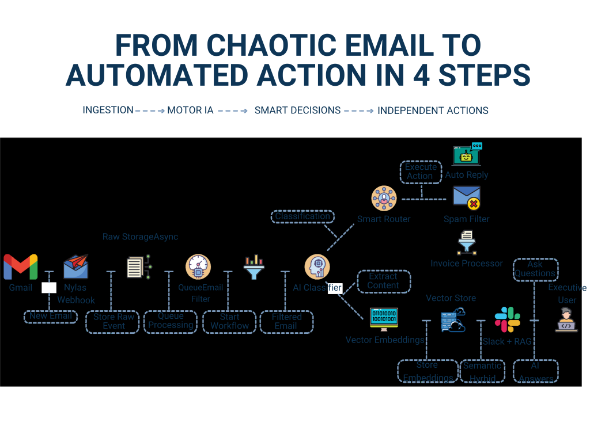
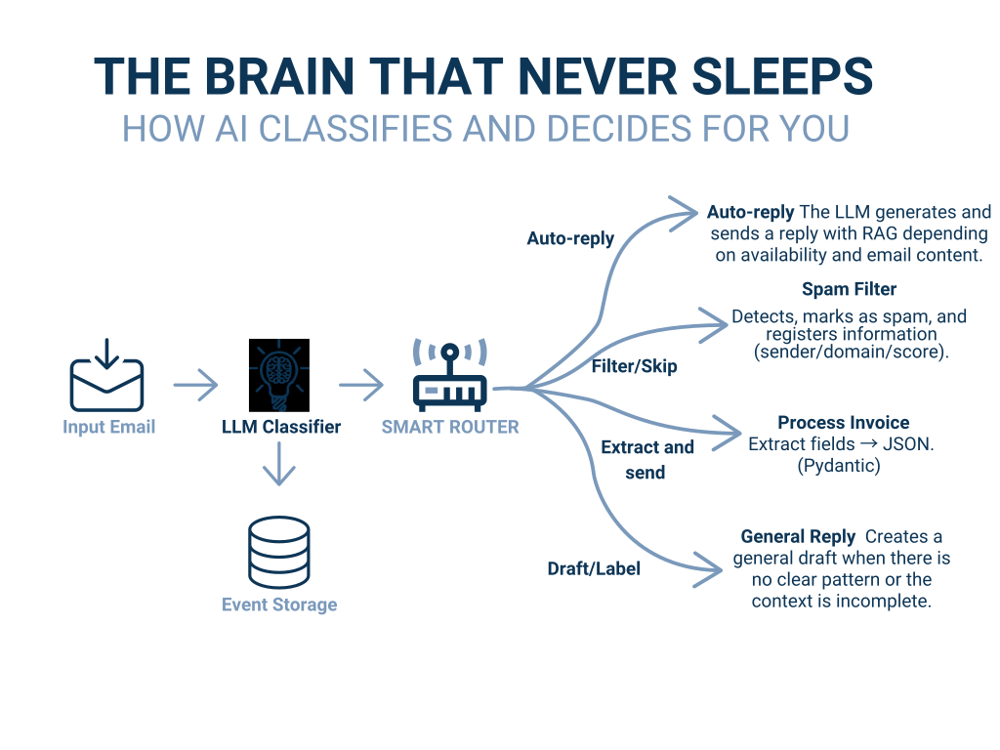

# AI-Powered Email Automation System

!!! abstract "Delivery snapshot"
    **Role**: AI Engineer  
    **Sector**: Tourism & hospitality
    **Goal**: Reduce time spent reviewing and prioritizing high-volume email traffic

!!! success "Measured impact"
    - Reduced daily email triage from **100+ items to 10-15 actionable items**
    - Automated classification and prioritization for live daily operations
    - Production system deployed and serving real users
    - Presented publicly at **Datamecum Webinar 2025**

!!! info "Core stack"
    <span class="tech-badge">PydanticAI</span>
    <span class="tech-badge">FastAPI</span>
    <span class="tech-badge">RAG</span>
    <span class="tech-badge">Python</span>
    <span class="tech-badge">Docker</span>
    <span class="tech-badge">Hetzner</span>

<div class="metric-highlight">
  <div class="metric-highlight-item">
    <span class="metric-number">100+ → 15</span>
    <span class="metric-label">daily emails requiring human review</span>
  </div>
  <div class="metric-highlight-item">
    <span class="metric-number">85%</span>
    <span class="metric-label">reduction in manual triage effort</span>
  </div>
  <div class="metric-highlight-item">
    <span class="metric-number">Real-time</span>
    <span class="metric-label">classification in production</span>
  </div>
</div>

## Business challenge

The client was drowning in a high volume of daily emails requiring manual review, classification, and response. The process was slow, error-prone, and diverted skilled professionals from higher-value tasks. They needed a system that could understand email content, classify urgency, and surface only the items that truly required human attention.

## Solution overview


*High-level architecture covering ingestion, retrieval, structured decisions, and API delivery.*


*End-to-end solution diagram from the Datamecum Webinar 2025 presentation.*


*Classification flow: how the AI processes, classifies, and routes each email.*

I designed the solution as a production workflow rather than a one-shot classifier:

- **Structured output contracts** with PydanticAI so the system returns validated, type-safe decisions instead of free-form text.
- **RAG classification** to ground decisions in domain policies, examples, and historical context.
- **FastAPI delivery layer** for real-time processing and clean integration with surrounding systems.
- **Deterministic routing** so prioritization behavior stays consistent across categories and edge cases.

## Key design decisions

- The workflow separates ingestion, classification, decision formatting, and delivery so each boundary can be tested and evolved independently.
- Business rules and confidence handling stay outside the prompt layer, reducing the risk of accidental regressions.
- The architecture follows hexagonal principles, making it easier to replace retrieval strategies or model providers without rewriting the service.

## Results in production

- Daily triage reduced from 100+ items to 10-15 actionable items
- Higher consistency in classification and prioritization
- Real-time processing fast enough for operational usage
- Architecture ready for future multi-tenant expansion

## Technical walkthrough

=== "Decision layer"
    ```python
    from pydantic import BaseModel
    from pydantic_ai import Agent

    class TriageDecision(BaseModel):
        priority: str
        category: str
        requires_human_review: bool

    agent = Agent(
        model="gpt-4o-mini",
        output_type=TriageDecision,
        system_prompt="Classify the email using company policies and examples."
    )
    ```

=== "API layer"
    ```python
    @app.post("/triage")
    async def triage_email(payload: EmailPayload) -> TriageDecision:
        decision = await triage_service.classify(payload)
        return decision
    ```

## Watch the technical talk

The project was presented publicly at Datamecum Webinar 2025, covering production architecture, implementation tradeoffs, and operational results.

<div class="embedded-video">
  <a href="https://youtu.be/cECPFYFLAVw?si=dh9k_iqe5bDFC_fv&t=472" target="_blank" rel="noopener" aria-label="Watch Datamecum Webinar 2025 on YouTube">
    
  </a>
</div>

<div class="cta-panel" markdown>

## Want to reduce manual triage or document-heavy operations?

If your team is spending too much time reviewing inbound communications or prioritizing repetitive work, this is the kind of automation pattern I can help implement safely.

<div class="cta-actions" markdown>
[Book a free intro call :material-arrow-top-right:](https://calendly.com/andresesanfiel/introduction-call){ .md-button .md-button--primary .track-conversion data-conversion-label="case_email_intro_call" target="_blank" rel="noopener" }
[Read the related blog post :material-arrow-right:](../../blog/posts/ai-email-automation-webinar.md){ .md-button }
</div>

</div>
