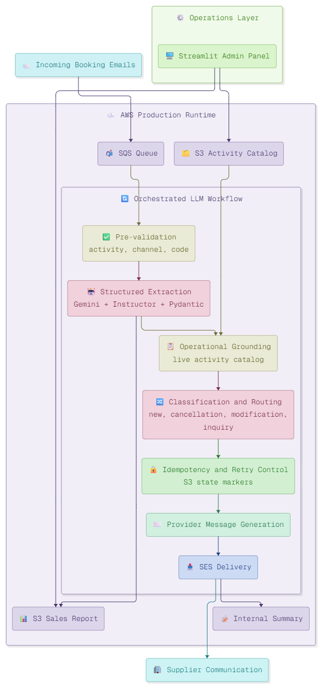

# AI-Powered Booking Email Automation

!!! abstract "Delivery snapshot"
    **Role**: AI Engineer 
    **Sector**: Tourism and activities operations 
    **Goal**: Automate the processing, classification, and routing of high-volume booking emails with supplier response generation

!!! success "Measured impact"
    - Reduced daily email triage from **100+ items to 10-15 actionable items**
    - Automated extraction, classification, and supplier communication across **4 booking categories**
    - Idempotent processing with zero duplicate supplier messages
    - Self-service operations via **Streamlit admin panel** - no engineering needed for day-to-day changes

!!! info "Core stack"
    Gemini
    Instructor
    Pydantic
    Python
    AWS SQS
    AWS SES
    AWS S3
    Streamlit

## Challenge

The operations team at a tourism and activities company was processing over 100 booking-related emails per day - new reservations, cancellations, modifications, and general inquiries - all manually. Each email had to be read, understood, matched against the current activity catalog, classified by type, and routed to the correct supplier or internal team.

The process was slow, inconsistent, and pulled skilled staff away from higher-value operational work. Emails were missed, duplicates were sent to suppliers, and there was no structured record of what had been processed or why.

They needed a system that could automatically understand booking emails, extract structured data, classify the request type, and generate the right supplier communication - without breaking when edge cases or retries appeared.

## Solution overview

I designed the system as an **orchestrated LLM workflow on AWS**, built around six processing stages with deterministic control at every step.

### Ingestion

- **Incoming booking emails** arrive and are queued via **AWS SQS**, decoupling email arrival from processing and giving the system backpressure control and retry safety from the first step.

### Pre-validation

- Before any LLM processing, the system filters incoming emails by **activity type, channel, and booking code**.
- This keeps inference costs predictable and prevents the AI layer from wasting tokens on irrelevant or malformed messages.

### Structured Extraction

- **Gemini** with **Instructor** and **Pydantic** models extracts validated, type-safe booking data from unstructured email text.
- Every field is validated against a schema before the workflow continues - no free-form LLM outputs pass through.
- Extracted data feeds into the **S3 Sales Report** for operational tracking.

### Operational Grounding

- Classification decisions are anchored to a **live activity catalog stored in S3**, so the system routes based on what is actually bookable today - not on stale or hallucinated context.
- When the catalog changes, the system adapts immediately without redeployment.

### Classification and Routing

- Each email is classified into one of four paths: **new booking, cancellation, modification, or inquiry**.
- Each path triggers different downstream logic and supplier communication templates.

### Idempotency and Retry Control

- **S3 state markers** prevent duplicate processing when emails are retried or redelivered by SQS.
- No booking gets processed twice. No supplier receives a duplicate message.

### Provider Message Generation and Delivery

- The system generates **supplier-ready communications** constrained by templates and business rules.
- **AWS SES** delivers the messages to suppliers and produces an **internal summary** for the operations team.

### Operations Layer

- A **Streamlit admin panel** gives the operations team direct control over the activity catalog and access to sales reports.
- Day-to-day configuration changes require zero engineering involvement.

## Key design decisions

- **LLM only where it adds value.** Pre-validation, routing logic, idempotency control, and delivery are all deterministic. The LLM handles extraction and message generation - the parts where unstructured language understanding is genuinely needed.
- **Structured outputs everywhere.** Gemini with Instructor and Pydantic models means every LLM response is validated before the workflow continues. If the output does not conform, the system retries or flags for review - it never silently passes bad data downstream.
- **Grounding against live operational data.** Classification is anchored to the real activity catalog in S3, not to the model's training data. This eliminates hallucinated availability and keeps routing accurate as the business changes.
- **Idempotency as a first-class concern.** Email systems retry. SQS redelivers. The workflow handles all of this gracefully through S3 state markers, so the operations team never has to manually check for duplicate supplier messages.
- **Self-service operations.** The Streamlit admin panel means the operations team owns their catalog and reporting without depending on engineering for every change. This reduces friction and keeps the system maintainable long-term.

## Results in production

- Daily email triage reduced from 100+ items to 10-15 actionable items
- Automated extraction and classification across four booking categories
- Supplier responses generated and delivered without manual intervention
- Zero duplicate messages to suppliers thanks to idempotent processing
- Operations team manages catalog and reporting through self-service admin panel
- System handles retries and edge cases without manual recovery

## Tech Stack

| Layer | Technology |
|---|---|
| LLM & extraction | Gemini, Instructor, Pydantic |
| Orchestration | Python, deterministic workflow control |
| Ingestion & queuing | AWS SQS |
| Storage & state | AWS S3 (activity catalog, sales reports, idempotency markers) |
| Email delivery | AWS SES |
| Admin interface | Streamlit |
| Infrastructure | AWS (SQS, SES, S3) |

## Processing high volumes of operational emails manually?

If your team is spending hours every day reading, classifying, and responding to structured communications - booking requests, supplier coordination, order confirmations, support tickets - and the decision logic is clear but the execution is still manual, this is the type of system I build.

[Book a free intro call :material-arrow-top-right:](https://calendly.com/andresesanfiel/introduction-call){ .md-button .md-button--primary .track-conversion data-conversion-label="case_booking_intro_call" target="_blank" rel="noopener" }

