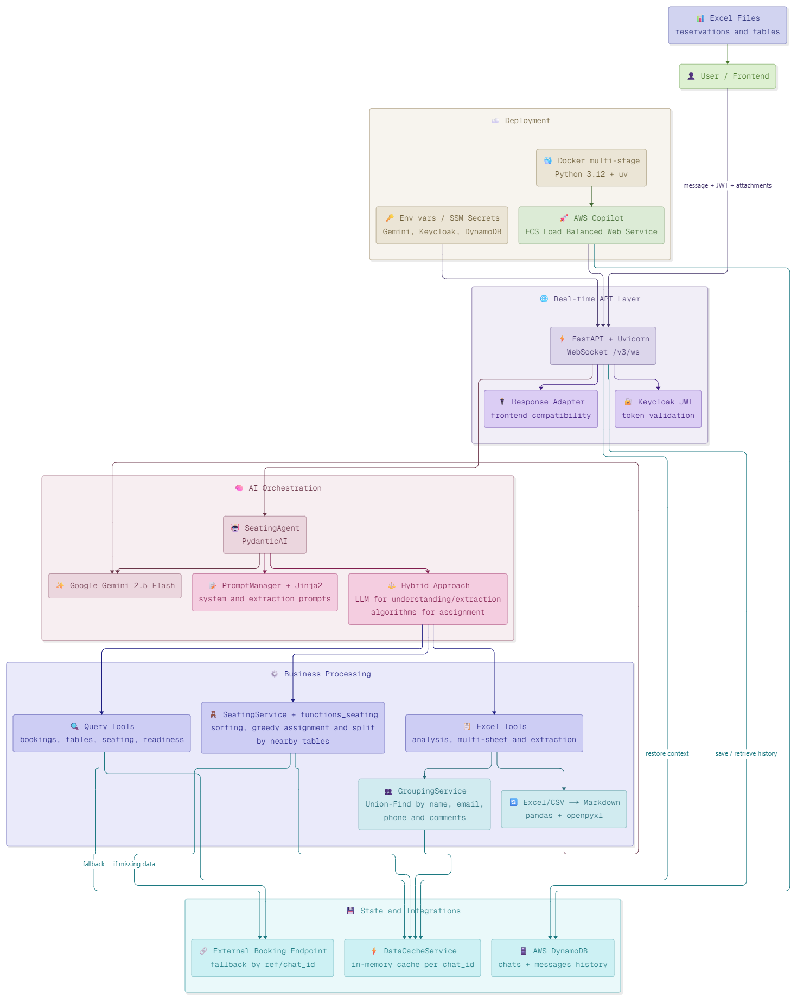

# Conversational AI Seating Agent

!!! abstract "Delivery snapshot"
    **Role**: AI Engineer(within a cross-functional product team) 
    **Sector**: Hospitality and restaurant operations 
    **Goal**: Replace manual seating assignment workflows with a conversational AI backend that processes files, applies business rules, and answers operational queries in real time

!!! success "Measured impact"
    - **Real-time file processing** - Excel uploads parsed, validated, and structured in a single WebSocket interaction
    - **Hybrid AI + deterministic logic** - LLM handles interpretation and extraction; business rules handle assignment
    - **Conversational operations** - Non-technical staff query reservation status, table availability, and seating assignments in natural language
    - **Session continuity** - Full conversation history persisted in DynamoDB across sessions

!!! info "Core stack"
    PydanticAI
    Gemini 2.5 Flash
    FastAPI
    WebSockets
    DynamoDB
    Keycloak
    Docker

## Challenge

Restaurant and venue operations teams manage seating through a mix of spreadsheets, manual coordination, and institutional knowledge. The typical workflow involves receiving Excel files with reservations and table layouts, manually cross-referencing names and party sizes, applying capacity constraints, handling duplicate records, and communicating assignments - all under time pressure before service begins.

The pain points were consistent: heterogeneous Excel formats with varying structures and multiple sheets, duplicate guest records scattered across entries, no structured way to query the current state of assignments, and a process that depended entirely on the operator's memory and attention to detail.

They needed a system that could ingest messy Excel files, extract clean reservation and table data, execute rule-based seating assignments, and let the operations team ask questions in natural language - all through a single interface, in real time.

## Solution overview

I designed the system as a **conversational AI backend** that combines LLM intelligence for understanding and extraction with deterministic logic for business-critical assignment decisions.

### Real-time WebSocket interface

- The operations team connects via **WebSocket** (FastAPI + Uvicorn) and sends messages with optional Excel/CSV file attachments.
- Every connection is authenticated via **JWT validated by Keycloak** before any processing begins.
- The system supports both file-based interactions (upload and process) and pure conversational queries (ask about current state) through the same interface.

### AI Agent with domain tools

- A **PydanticAI agent powered by Gemini 2.5 Flash** orchestrates the workflow, deciding which domain tools to invoke based on user intent and attached files.
- **Dynamic prompts via Jinja2** adapt the agent's behavior to the current context - whether the user is uploading a new file, asking about a specific reservation, or requesting a seating assignment.
- The agent has access to specialized tools for Excel analysis, reservation extraction, table extraction, seating assignment, and operational queries.

### File processing and data extraction

- The system analyzes **Excel file structure** including multi-sheet scenarios, detecting which sheets contain reservations and which contain table layouts.
- **Reservation extraction** handles heterogeneous formats, identifies relevant fields, and groups records that represent the same person across duplicate entries (matching by name, email, or phone).
- **Table extraction** maps available seating with capacity constraints and layout metadata.

### Deterministic seating assignment

- Once reservations and tables are extracted, a **heuristic assignment engine** applies capacity constraints and business rules to produce a seating plan.
- This layer is fully deterministic - no LLM involvement in the actual assignment logic. The AI interprets and extracts; the rules decide.
- Results are returned as structured data that the frontend or downstream system can consume directly.

### Conversational queries and session continuity

- After processing, the operations team can query the system in natural language: "How many unassigned reservations are left?", "Which table has the most capacity?", "Show me all bookings for Garcia."
- **Conversation history is persisted in DynamoDB** per chat session, so the user can disconnect and resume later without losing context.
- **In-memory cache per chat_id** keeps frequently accessed data fast for follow-up queries within the same session.

## Key design decisions

- **Hybrid AI + deterministic approach.** The LLM handles what it is good at - understanding messy inputs, extracting structured data from unstructured files, and enabling natural language interaction. But the actual seating assignment is deterministic. Business-critical decisions do not depend on probabilistic model outputs.
- **WebSocket-first architecture.** File upload, processing, and conversational interaction happen through a single persistent connection. This eliminates the overhead of multiple HTTP round-trips and enables real-time streaming of results as processing progresses.
- **Authentication before processing.** JWT validation via Keycloak happens at connection time, before any message is processed. This keeps the security boundary clean and prevents unauthenticated requests from reaching the AI layer.
- **Session persistence for operational continuity.** DynamoDB stores the full conversation history per chat, so the system can restore context across sessions. Combined with in-memory caching, this means fast responses for follow-up queries without re-processing files.
- **Schema-flexible file ingestion.** The system does not require a fixed Excel template. It analyzes the structure of whatever file is uploaded - including multi-sheet workbooks with inconsistent formats - and adapts extraction accordingly. This is critical in hospitality where every venue has their own spreadsheet conventions.

## Results in production

- Real-time processing of heterogeneous Excel files through a single WebSocket interface
- Automated extraction and deduplication of reservation records across inconsistent formats
- Deterministic seating assignment with capacity constraints and business rules
- Natural language query interface accessible to non-technical operations staff
- Full session continuity with persistent conversation history across reconnections
- Authenticated access with JWT/Keycloak ensuring secure multi-user operation

## Tech Stack

| Layer | Technology |
|---|---|
| API & real-time communication | FastAPI, Uvicorn, WebSockets |
| AI agent & orchestration | PydanticAI, Gemini 2.5 Flash, Jinja2 dynamic prompts |
| File processing | pandas, openpyxl |
| Seating logic | Deterministic heuristic engine (Python) |
| Authentication | JWT, Keycloak |
| Persistence & caching | DynamoDB (history), in-memory cache per chat_id |
| Infrastructure | Docker, containerized deployment |
| Quality | pytest, pytest-asyncio, ruff |

## Running operations on spreadsheets and manual coordination?

If your team is spending time before every service manually processing reservation files, cross-referencing capacity, and answering status questions from memory - and the logic is clear but the execution is still manual - this is the type of system I build.

[Book a free intro call :material-arrow-top-right:](https://calendly.com/andresesanfiel/introduction-call){ .md-button .md-button--primary .track-conversion data-conversion-label="case_seating_intro_call" target="_blank" rel="noopener" }

