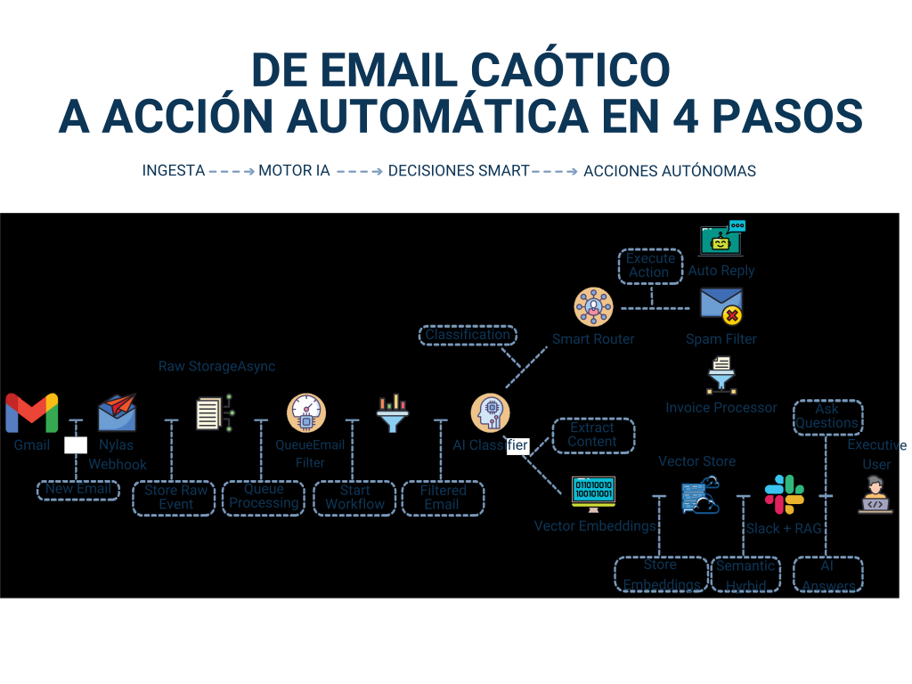
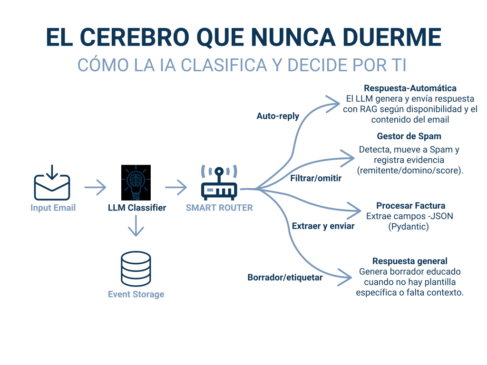

# Sistema de automatización de email con IA

!!! abstract "Resumen de entrega"
    **Rol**: AI Engineer 
    **Sector**: Productividad y automatización de operaciones 
    **Objetivo**: Convertir bandejas de entrada caóticas en workflows automatizados y estructurados con trazabilidad y control humano

!!! success "Impacto medible"
    - Reducción del triaje diario de **100+ emails a 10-15 items accionables**
    - Clasificación, enrutamiento y generación de respuestas automatizados en múltiples categorías de email
    - Dos canales de entrega: **notificaciones inteligentes** y **asistente conversacional vía Slack + RAG**
    - Observabilidad completa en producción con **Langfuse** (trazas, coste por email, tracking de calidad)
    - Presentado como Technical Speaker en **[Datamecum Webinar 2025](https://youtu.be/cECPFYFLAVw?si=AfFpwbT-skWP5LGp){ target="_blank" rel="noopener" }**

!!! info "Stack principal"
    PydanticAI
    OpenAI
    FastAPI
    Celery
    PostgreSQL + pgvector
    Redis
    Slack
    Langfuse
    Docker

  

    100+ → 15
    emails diarios que requieren revisión humana
  

  

    85%
    reducción en esfuerzo de triaje manual
  

  

    Tiempo real
    clasificación en producción
  

## Reto

El profesional medio recibe más de 120 emails al día y dedica aproximadamente el 28% de su tiempo de trabajo a gestionarlos. Los mensajes críticos se pierden, las respuestas se retrasan y el cambio constante de contexto drena la productividad.

El objetivo era construir un sistema capaz de ingestar emails entrantes automáticamente, entender su contenido, clasificarlos por tipo y urgencia, y ejecutar la acción correcta - todo con trazabilidad completa y supervisión humana cuando fuera necesario. No una herramienta de filtrado. Un pipeline de producción que lee, decide y actúa.

## Resumen de la solución

*Diagrama de solución end-to-end de la presentación en Datamecum Webinar 2025.*

*Flujo de clasificación: cómo la IA procesa, clasifica y enruta cada email.*

El sistema sigue cuatro etapas: **Ingestión → Motor de IA → Decisiones inteligentes → Acciones autónomas**.

### Ingestión

- **Integración con Gmail vía Nylas** mediante webhooks que capturan emails entrantes en tiempo real.
- Los eventos de email se almacenan de forma asíncrona y se encolan para procesamiento.
- Un **filtro de email** pre-evalúa los mensajes antes de cualquier procesamiento LLM, manteniendo los costes de inferencia predecibles y evitando computación desperdiciada en tráfico irrelevante.

### Motor de IA

- Un **clasificador LLM** (basado en OpenAI) analiza los emails filtrados y extrae contenido estructurado usando **PydanticAI**, produciendo salidas validadas y tipadas - ningún texto libre sale de esta etapa.
- El contenido extraído se embebe en **PostgreSQL + pgvector** para búsqueda semántica y retrieval de contexto a largo plazo.

### Decisiones inteligentes

Un **smart router determinista** clasifica cada email y lo envía por el camino correcto:

- **Auto-respuesta** - El LLM genera y envía una respuesta contextual usando RAG, basándose en disponibilidad y contenido del email.
- **Borrador y etiquetado** - Genera un borrador cuando no existe una plantilla específica o el contexto es insuficiente, y etiqueta el email para revisión humana.
- **Filtrar y descartar** - Detecta spam, lo mueve a la carpeta de spam y registra evidencia (remitente, dominio, puntuación).
- **Extraer y reenviar** - Extrae campos estructurados (JSON vía Pydantic) de facturas y emails operativos, y los enruta downstream.

### Acciones autónomas y entrega

El sistema entrega resultados a través de **dos canales**:

- **Notificaciones inteligentes** - Alertas proactivas enviadas a Slack: email urgente detectado, importe de nueva factura, spam movido, fragmentos de email para contexto rápido.
- **Asistente conversacional** - Una interfaz RAG basada en Slack donde el usuario puede hacer preguntas como "¿Qué facturas están pendientes?", "Resume el último email de X" o "¿Qué dijo Y sobre Z?" - todo fundamentado en contexto de pgvector.

## Decisiones clave de diseño

- **LLM solo donde aporta valor.** El filtrado de emails, la lógica de enrutamiento y el almacenamiento son deterministas. El LLM se encarga de clasificación, extracción y generación de respuestas - las partes donde realmente se necesita comprensión de lenguaje no estructurado.
- **Salidas estructuradas en todas partes.** PydanticAI garantiza que cada respuesta del LLM se valida contra un esquema antes de que el workflow continúe. Si la salida no cumple, el sistema reintenta o marca - nunca deja pasar datos incorrectos en silencio.
- **Privacidad y control de datos por diseño.** Scopes OAuth mínimos vía Nylas, redacción y cifrado de PII, sin vendor lock-in. Todo el sistema corre en una VM de Hetzner a una fracción de lo que cuestan las suites enterprise.
- **Observabilidad completa con Langfuse.** Cada email procesado genera una traza: latencia por nodo, coste LLM por email, uso de tokens, versión del modelo y anotaciones de calidad. Langfuse actúa como la caja negra abierta del pipeline - si algo se rompe o desvía, la traza muestra exactamente dónde y por qué.
- **Escalable horizontalmente.** Docker + FastAPI + Celery significa que el sistema puede escalar workers de forma independiente conforme crece el volumen de emails, sin re-arquitectar.

## Resultados en producción

- Triaje diario de emails reducido de 100+ items a 10-15 accionables
- Clasificación y enrutamiento automatizados en múltiples categorías de email
- Auto-respuestas contextuales generadas y enviadas sin intervención manual
- Asistente conversacional que permite consultas en lenguaje natural sobre el historial de emails
- Observabilidad completa de coste y calidad por email procesado
- Coste de infraestructura significativamente menor comparado con plataformas enterprise de automatización de email

## Stack tecnológico

| Capa | Tecnología |
|---|---|
| LLM y salidas estructuradas | OpenAI, PydanticAI |
| Orquestación | Python, FastAPI, Celery |
| Integración de email | Nylas (webhooks Gmail, scopes OAuth mínimos) |
| Vector storage y RAG | PostgreSQL + pgvector, búsqueda híbrida semántica |
| Caché | Redis |
| Canales de entrega | Slack (notificaciones + asistente conversacional) |
| Observabilidad | Langfuse (trazas, tracking de costes, anotaciones de calidad) |
| Infraestructura | Docker, Hetzner VM |

## Ver la charla técnica

Este sistema se presentó públicamente en **Datamecum Webinar 2025**, recorriendo la arquitectura de producción completa, el diseño del smart router, la comparación de costes con alternativas enterprise y una demo en vivo.

  

## ¿Pierdes horas en triaje de email cada día?

Si tu equipo clasifica, ordena y responde manualmente grandes volúmenes de comunicaciones estructuradas - y la lógica de decisión está clara pero la ejecución sigue siendo manual - este es el tipo de pipeline de producción que construyo.

[Reserva una llamada gratuita :material-arrow-top-right:](https://calendly.com/andresesanfiel/introduction-call){ .md-button .md-button--primary .track-conversion data-conversion-label="case_email_intro_call_es" target="_blank" rel="noopener" }
[Leer el post relacionado :material-arrow-right:](../../blog/posts/ai-email-automation-webinar.md){ .md-button }

